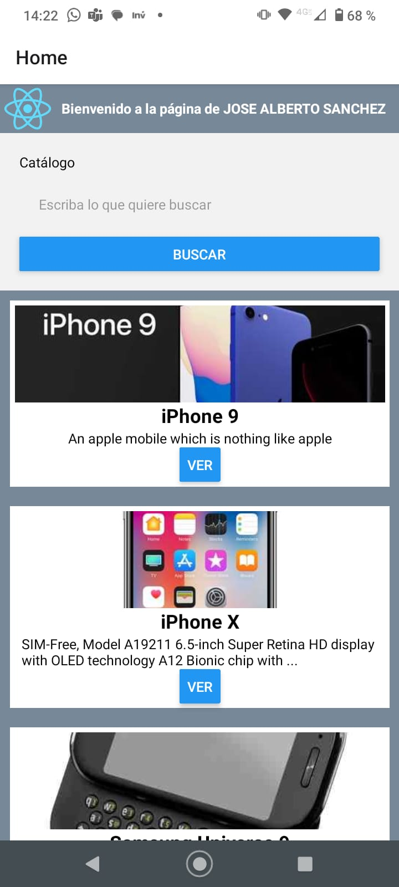
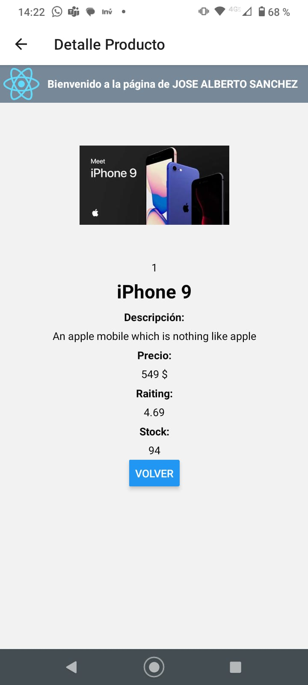

# Product list example using React Native

Solution for P3_RN_productos from React Native course by UPM taken in MiriadaX.

This project shows an example to implement Stack.Navigation in Ract Native and filter the result in a FlatList.

    
    

## Requirements

- NodeJS 16 (LTS)+
- yarn
- Expo Go

## Setup

1. Install Expo Go https://reactnative.dev/docs/environment-setup?guide=quickstart
2. Install dependencies `yarn install`
2. Run project `npm start`

